# Repository and Deployment Architecture

How this repo is organized, and how the shared automation adapts to Splunk
Cloud, Enterprise (on-prem), hybrid deployments, and the runtime roles inside
those topologies.

## Repository Architecture

This document complements `README.md`: the README is the operator-facing
overview, while this file focuses on the architectural boundaries inside the
repo and the runtime deployment models those scripts target.

### Core Building Blocks

| Path | Role |
|------|------|
| `skills/<skill>/` | Skill-specific docs and automation for install, setup, validation, and optional MCP loading |
| `skills/shared/lib/` | Shared platform layer for credentials, ACS, REST, Splunkbase, account helpers, and host bootstrap helpers |
| `skills/shared/scripts/` | Shared operational entrypoints such as credential setup and cloud batch install/uninstall |
| `skills/shared/app_registry.json` | Single source of truth for Splunkbase IDs, package patterns, app names, license-ack metadata, and role placement |
| `splunk-ta/` | Local package cache for downloaded or manually staged `.tgz`, `.tar.gz`, `.rpm`, `.deb`, or `.spl` archives |
| `splunk-ta/_unpacked/` | Review-only extracted copies, not the normal deployment path |
| `tests/` and `.github/workflows/ci.yml` | Regression coverage for helper libraries and first-party shell scripts |

### Shared Helper Modules

All skill scripts source `skills/shared/lib/credential_helpers.sh`, which is a
compatibility shim over the focused shared modules:

| Module | Responsibility |
|--------|----------------|
| `credential_helpers.sh` | Sources the shared modules and locates the active credentials file |
| `credentials.sh` | Loads credential files, resolves profiles, and detects Cloud vs Enterprise vs hybrid targets |
| `acs_helpers.sh` | ACS login/context, current search-head resolution, `search-api` allowlisting, and Cloud index/restart helpers |
| `rest_helpers.sh` | Search-tier REST wrappers for apps, configs, inputs, saved searches, HEC, and validation |
| `splunkbase_helpers.sh` | Splunkbase authentication and package download helpers |
| `configure_account_helpers.sh` | Shared create-or-update flow for TA account endpoints |
| `host_bootstrap_helpers.sh` | Shared SSH, package staging, checksum, and remote file helpers for first-install host automation |

### Skill Composition Pattern

Most skills follow the same layout, even if some omit optional files:

| File / directory | Purpose |
|------------------|---------|
| `SKILL.md` | Agent-facing instructions and expected workflow |
| `reference.md` | Product-specific notes such as input families, field mappings, or behavioral caveats |
| `scripts/setup.sh` | Default setup workflow |
| `scripts/validate.sh` | Post-deployment verification |
| `scripts/load_mcp_tools.sh` + `mcp_tools.json` | Optional search tooling loaded into `Splunk_MCP_Server` |

### Installer And Package Flow

- `skills/splunk-app-install/scripts/install_app.sh` is the generic app-delivery
  entrypoint used across the repo.
- On Splunk Enterprise, the installer installs local server paths directly and
  stages remote local-package installs over SSH before calling the management
  API with `filename=true`.
- On Splunk Cloud, the installer uses ACS and consults
  `skills/shared/app_registry.json` to map known package files to Splunkbase app
  installs, license acknowledgements, and expected app names.
- `skills/shared/scripts/cloud_batch_install.sh` batches ACS installs and
  performs a post-install identity check to catch corrupted or mis-mapped app
  deployments.

### Platform And Deployment Role

This repo separates **platform selection** from **deployment role**:

- Platform selection decides whether the helpers are using Splunk Cloud or
  self-managed Splunk Enterprise APIs.
- Deployment role describes where a package or end-to-end skill belongs inside
  the topology.

The role model uses five names:

- `search-tier`
- `indexer`
- `heavy-forwarder`
- `universal-forwarder`
- `external-collector`

Use `DEPLOYMENT_ROLE_MATRIX.md` for the role placement truth for each package
and skill. Use `CLOUD_DEPLOYMENT_MATRIX.md` when the question is specifically
about Cloud install or configuration behavior.

At runtime, the warning layer can consume `SPLUNK_TARGET_ROLE` and
`SPLUNK_SEARCH_TARGET_ROLE` to describe what the active management endpoint
represents and what paired runtime may exist alongside it. These are
deployment-role hints, not delivery-plane selectors. Per-run environment values
override the selected profile's role metadata.

### Skill Roles

The current skills fall into eight architectural roles:

- **Collector/setup skills** — install apps, create indexes, configure accounts,
  and enable inputs. Examples: AppDynamics, Catalyst, DC Networking,
  Intersight, Meraki, Security Cloud, Secure Access, and ThousandEyes.
- **Parser/mapping skills** — install supporting add-ons that contribute field
  mappings or search-time parsing context but rely on a separate ingestion path.
  Example: `cisco-catalyst-enhanced-netflow-setup`.
- **Search-time / visualization skills** — configure macros, saved searches, or
  data model behavior on top of data collected elsewhere. Examples:
  `cisco-enterprise-networking-setup`, `splunk-itsi-config`, and
  `splunk-enterprise-security-config`. Splunk Observability dashboard planning
  is covered by `splunk-observability-dashboard-builder`, which does not target
  a Splunk Platform runtime role. Native Observability operations are covered by
  `splunk-observability-native-ops`, which renders supported API payloads,
  validation requests, deeplinks, and handoffs for UI-only surfaces.
- **External collector skills** — prepare Splunk-side objects and render
  customer-managed runtimes outside Splunk. Examples:
  `splunk-connect-for-syslog-setup`, `splunk-connect-for-snmp-setup`,
  `splunk-observability-otel-collector-setup`, and
  `splunk-edge-processor-setup` (Splunk-managed source-types,
  destinations, and SPL2 pipelines on a customer-managed Linux instance tier).
- **Platform/package skills** — manage generic app delivery or multi-component
  app stacks. Examples: `splunk-app-install`, `splunk-stream-setup`,
  `splunk-enterprise-host-setup`, `splunk-enterprise-kubernetes-setup`,
  `splunk-enterprise-security-install`, `splunk-itsi-setup`, and
  `splunk-mcp-server-setup`.
- **Platform service skills** — render and manage cross-cutting Splunk
  Enterprise platform services that other skills consume as a contract.
  Examples: `splunk-hec-service-setup` (HTTP Event Collector tokens, allowed
  indexes, ACS payloads), `splunk-federated-search-setup` (FSS2S/FSS3
  providers and indexes), `splunk-index-lifecycle-smartstore-setup`
  (SmartStore volumes and retention), `splunk-monitoring-console-setup`
  (distributed/standalone MC), `splunk-workload-management-setup`
  (cgroups workload pools and rules), `splunk-license-manager-setup`
  (license manager + peers), `splunk-agent-management-setup` (server
  classes / deployment apps), and `splunk-universal-forwarder-setup`
  (UF runtime bootstrap).
- **Cluster operations skills** — orchestrate multi-host Splunk Enterprise
  deployments above per-host install. Example:
  `splunk-indexer-cluster-setup` (single-site / multisite bootstrap, bundle
  apply, rolling restart, peer offline, manager redundancy, and migration).
- **Splunk security product skills** — install, configure readiness, and
  validate the SIEM portfolio above the platform tier. Examples:
  `splunk-enterprise-security-install`, `splunk-enterprise-security-config`
  (operational ES configuration as code), `splunk-security-essentials-setup`,
  `splunk-attack-analyzer-setup` (Splunk_TA_SAA + Splunk_App_SAA + index +
  macro), `splunk-asset-risk-intelligence-setup` (ARI indexes, KV Store, and
  ES Exposure Analytics handoff), `splunk-soar-setup` (On-prem single +
  cluster, SOAR Cloud onboarding, Automation Broker, Splunk-side apps, and
  ES integration), `splunk-uba-setup` (UBA / Premier UEBA migration
  readiness), and `splunk-security-portfolio-setup` (router that resolves
  product names to the right delegate skill).
- **Splunk Cloud control-plane skills** — manage Cloud-only platform surfaces.
  Example: `splunk-cloud-acs-allowlist-setup` (the seven ACS IP allowlist
  features for IPv4 and IPv6 with subnet-limit and lock-out preflight).

### CI And Validation

The repo treats the shared shell libraries as first-party code with regression
coverage. `.github/workflows/ci.yml` runs:

- `pytest` for Python tests
- `bats` for shell behavior tests
- `bash -n` for shell syntax checks
- `shellcheck` for static shell linting

## Deployment Models

### Splunk Cloud

All infrastructure is managed by Splunk. The repo interacts through two API
surfaces: ACS for platform operations and the search-tier REST API on port 8089
for app-specific configuration.

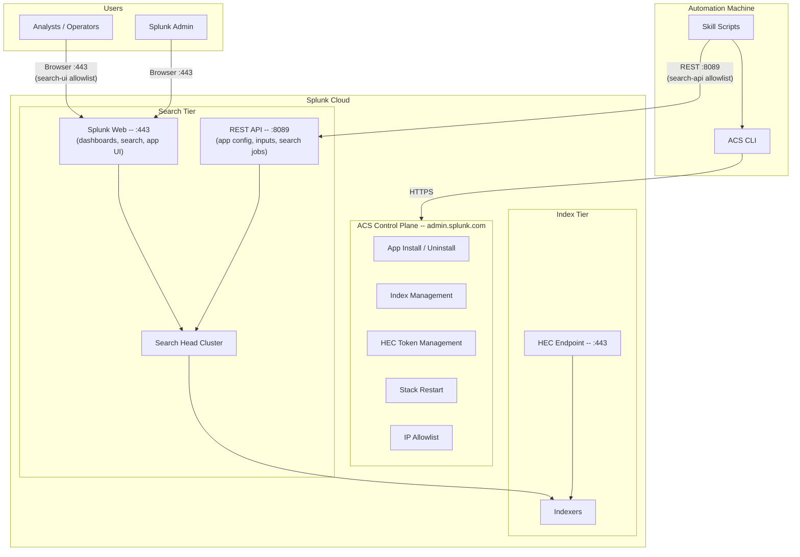

**Credential flow**: ACS uses `STACK_TOKEN` or `STACK_USERNAME/PASSWORD` plus
`SPLUNK_USERNAME/PASSWORD` for Splunkbase operations. Search-tier REST uses
`SPLUNK_USER/PASS` (defaulting to `STACK_USERNAME/PASSWORD` on Cloud).

**Automatic behaviors**:
- Direct search-head resolution via ACS to bypass SHC propagation delays
- Public IP auto-added to search-api allowlist
- Stack-local credentials swapped in for 8089 auth

### Splunk Cloud Stack Types: Victoria vs Classic

Splunk Cloud Platform ships in two architectural variants. Most ACS automation
in this repo works on either, but the available product surface differs:

| Aspect | Victoria | Classic |
|---|---|---|
| Default for new stacks | Yes (since 2023) | Pre-existing stacks; new stacks rare |
| ACS API surface | Full coverage of apps, indexes, HEC, allowlists, restart, federated providers | Same core surface; some newer endpoints (e.g. FSS3) are Victoria-only |
| Self-service Splunkbase installs | Broader (most public apps work) | Narrower; some apps require Splunk Cloud Support |
| Premium app installs (ES, ITSI) | Coordinate with Splunk Support; ACS install paths exist for some Victoria stacks | Splunk Cloud Support managed |
| Search Head Cluster | Always-clustered; no standalone SH | Always-clustered |
| AI Assistant for SPL | Self-service via ACS Splunkbase install on eligible commercial regions | Coordinate with Splunk Cloud Support |
| Federated Search Service v3 (FSS3) | Supported | Not supported (use FSS2S only) |
| Region availability | Most modern AWS regions | Reduced footprint |

**How to identify the stack type for a given deployment:** there is no single
ACS field that returns "Victoria" or "Classic" directly. Operators can check
`acs status current-stack` and look at the deployment metadata, or contact
Splunk Cloud Support. When a skill behaves differently between the two
variants, the skill's `reference.md` calls it out explicitly:

| Skill | Stack-type sensitivity |
|---|---|
| `splunk-federated-search-setup` | FSS3 is Victoria-only; FSS2S works on both |
| `splunk-ai-assistant-setup` | Self-service install requires Victoria + eligible commercial region |
| `splunk-enterprise-security-install` | Cloud installs are Splunk-managed regardless of variant; this skill targets self-managed search heads only |
| `splunk-itsi-setup` / `splunk-itsi-config` | Cloud installs are Splunk-managed regardless of variant; native config workflow runs against the search tier |
| `splunk-mcp-server-setup` | Private package; install requires coordination with Splunk regardless of variant |

When automating against Splunk Cloud, prefer behavior that does not branch on
stack type. When the underlying product genuinely requires one variant, fail
fast with a clear message that tells the operator to verify their stack type
with Splunk Cloud Support rather than retrying.

### ACS Deployment Caveats

ACS app installs are generally reliable but have several edge cases that the
scripts defend against:

**App content corruption** — When multiple Splunkbase apps are installed in
rapid succession (especially after uninstall/reinstall cycles), ACS can
occasionally deploy the wrong app's files into another app's directory. This
corrupts the affected app: its custom REST handlers return 404, modular input
types do not register, and `app.conf` shows metadata from a different app. The
`cloud_batch_install.sh` script includes a post-install verification pass that
queries each app's `configs/conf-app/package` endpoint to confirm the `id`
field matches the expected app name. If a mismatch is detected, uninstall the
affected app and reinstall it individually.

**Visibility defaults to false** — TAs installed via ACS may have
`visible=false` in their app settings, making them invisible in Splunk Web. The
skill-specific `setup.sh` scripts auto-fix this by POSTing `visible=true` to
`/services/apps/local/{app}` during the default setup flow.

**409 on reinstall** — If ACS believes an app is already installed, a fresh
`apps install splunkbase` returns HTTP 409. The batch installer treats this as a
skip rather than a failure. To force a re-deployment, uninstall first via
`acs apps uninstall`, wait for the stack to settle, then install again.

### Enterprise (On-Prem)

A single Splunk instance or a distributed deployment under your control. All
operations go through the REST API on port 8089. ACS is not involved.

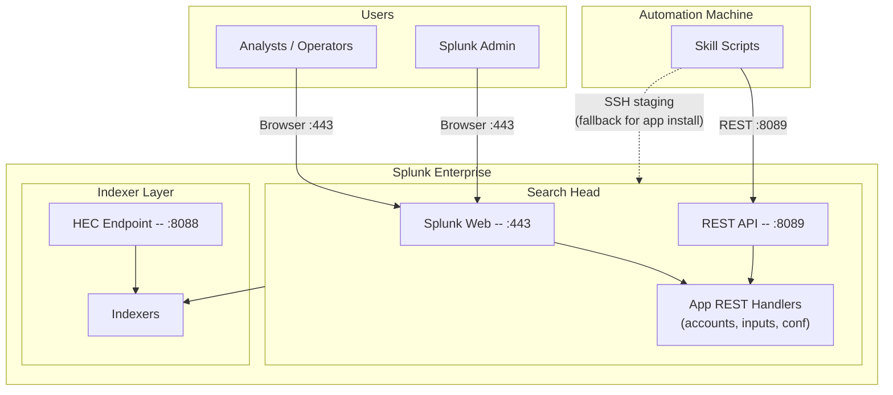

**Credential flow**: `SPLUNK_USER/PASS` for REST API access. `SPLUNK_SSH_*` for
remote local-package staging when the Splunk host cannot read the package from
the local workstation path.

**App install paths**:
1. Local Splunk host: install the server-local package path through `/services/apps/local` with `filename=true`
2. Remote Splunk host: stage the package to `/tmp` over SSH, then install that staged server-local path through `/services/apps/local` with `filename=true`

### Hybrid (Cloud + Heavy Forwarder)

The most common production pattern for data collection TAs on Splunk Cloud.
The search tier runs in Splunk Cloud, but data collection happens on a
customer-controlled heavy forwarder (HF) or universal forwarder (UF).

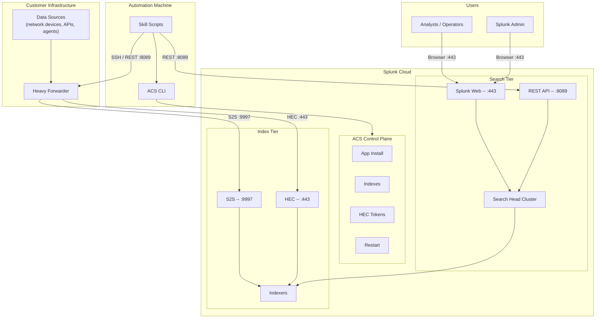

**Credential flow**: The `credentials` file contains both Cloud (ACS/stack)
settings and Enterprise (HF) settings. The repo supports two resolution
strategies:

1. **Profile-based** -- `SPLUNK_PROFILE=cloud` and
   `SPLUNK_SEARCH_PROFILE=hf` in the credentials file. Cloud keeps
   platform/ACS settings while HF overrides search-tier REST and SSH settings.
   Add `SPLUNK_TARGET_ROLE=search-tier` and
   `SPLUNK_SEARCH_TARGET_ROLE=heavy-forwarder` when you want warning-only role
   checks to follow that split.
2. **Platform override** -- `SPLUNK_PLATFORM=cloud` or
   `SPLUNK_PLATFORM=enterprise` per command to select the target explicitly.

When ambiguous, interactive scripts prompt the user to choose.

**Typical hybrid operations**:

| Operation | Target | API Surface |
|-----------|--------|-------------|
| App install on search tier | Cloud | ACS |
| Index creation | Cloud | ACS |
| TA account config on search tier | Cloud search head | REST :8089 |
| App install on HF | HF | REST :8089 or SSH |
| Input config on HF | HF | REST :8089 |
| Forwarder output config | HF | Host-level config |

Runtime role and delivery plane stay separate in this model. A package can be
classified as `search-tier` while still being delivered through ACS on Cloud or
through a deployer/cluster-manager path in Enterprise.

## How Scripts Select the Target

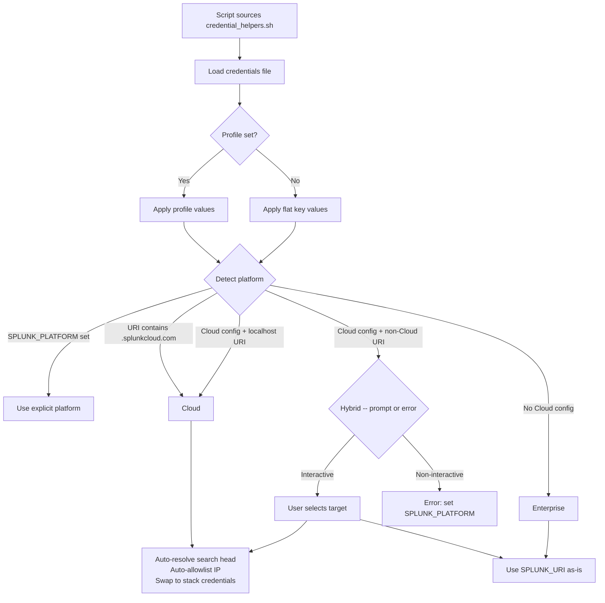

## Port Usage Summary

| Port | Service | Used By | Allowlist Feature |
|------|---------|---------|-------------------|
| 443 | Splunk Web (UI) | Browser access | `search-ui` |
| 443 | HEC ingestion | ThousandEyes streams, webhook alerts | `hec` |
| 8089 | Search-tier REST API | All TA configuration and validation | `search-api` |
| 8089 | IDM API | Add-on data ingestion | `idm-api` |
| 8088 | HEC (Enterprise) | Enterprise HEC ingestion | N/A (local) |
| 9997 | S2S forwarding | HF/UF to Cloud indexers | `s2s` |
| 22 | SSH | Enterprise app staging fallback | N/A (local) |

## Data Flow by TA Type

### Polling And App-Managed API TAs (AppDynamics, Catalyst, Meraki, Intersight, DC Networking)

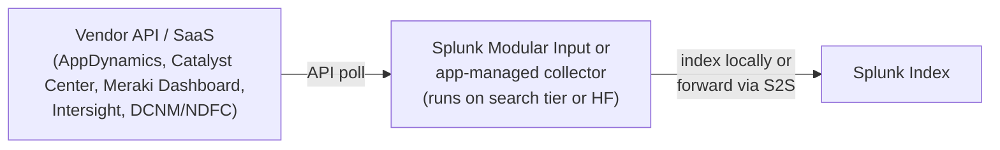

`cisco-security-cloud-setup` and `cisco-secure-access-setup` fit the same
collector/setup role, but they lean more heavily on app-specific REST handlers,
product wrappers, and packaged defaults than the simplified modular-input flow
shown above.

### HEC Push TAs (ThousandEyes)

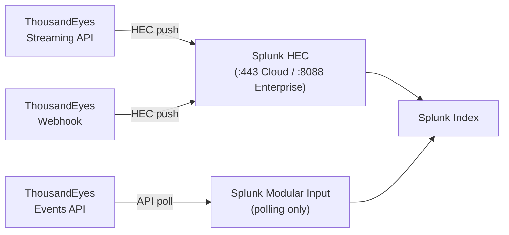

### Passive Capture (Splunk Stream)

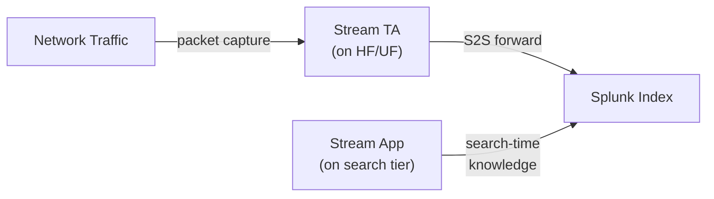

**Implementation guardrail**: in Splunk Cloud, `splunk-stream-setup` only
supports index creation against the Cloud stack. Installing Stream apps and
configuring `Splunk_TA_stream` must target the forwarder or Enterprise
management endpoint, because Stream remains a hybrid deployment.

### External Syslog Collector (SC4S)

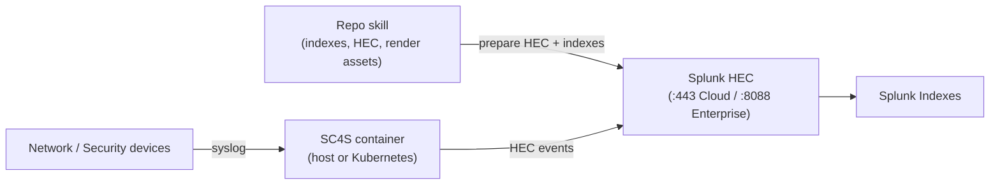

**Implementation guardrail**: `splunk-connect-for-syslog-setup` does not deploy
SC4S onto the Splunk Cloud search tier. The skill prepares the Splunk-side
objects and renders runtime assets for customer-managed Docker/Podman/systemd
or Kubernetes infrastructure.

### External SNMP Collector (SC4SNMP)

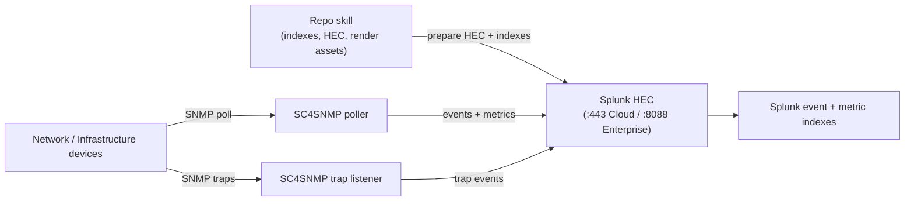

**Implementation guardrail**: `splunk-connect-for-snmp-setup` does not deploy
SC4SNMP onto the Splunk Cloud search tier. The skill prepares the Splunk-side
objects and renders runtime assets for customer-managed Docker Compose or
Kubernetes infrastructure.

### External OpenTelemetry Collector

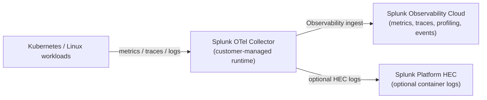

**Implementation guardrail**: `splunk-observability-otel-collector-setup` does
not install anything on the Splunk Cloud search tier. It renders Kubernetes
Helm values, Kubernetes secret helpers, and Linux installer wrappers for
customer-managed runtimes, with Observability and optional Platform HEC tokens
kept in local secret files.

`splunk-observability-dashboard-builder` is the companion workflow for Splunk
Observability Cloud dashboards. It renders and validates classic dashboard API
payloads and can apply them only when explicitly requested, but it does not
install collectors or belong on a Splunk Enterprise role.

`splunk-observability-native-ops` is the native operations companion. It covers
detectors, alert routing, Synthetics, APM topology and trace workflows, RUM
sessions, modern logs chart handoffs, and On-Call handoffs without claiming a
Splunk Platform runtime placement.

### Search-Time And Premium Apps

Some skills do not own the collection path at all. They sit on top of existing
indexes and configure search-time knowledge objects, dashboards, or premium app
features.

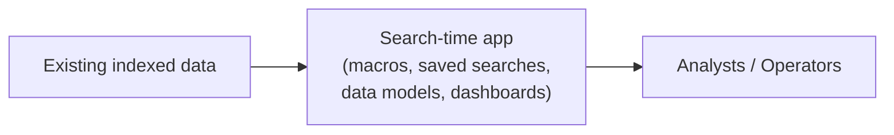

**Examples**:
- `cisco-enterprise-networking-setup` updates macros, enables saved searches,
  and can enable data model acceleration for the visualization app.
- `splunk-itsi-setup` installs and validates the premium app layer that other
  skills may integrate with.
- `splunk-enterprise-security-install` installs ES and runs `essinstall`;
  `splunk-enterprise-security-config` handles ES indexes, roles, data models,
  enrichment, detections, risk, and operational validation.
