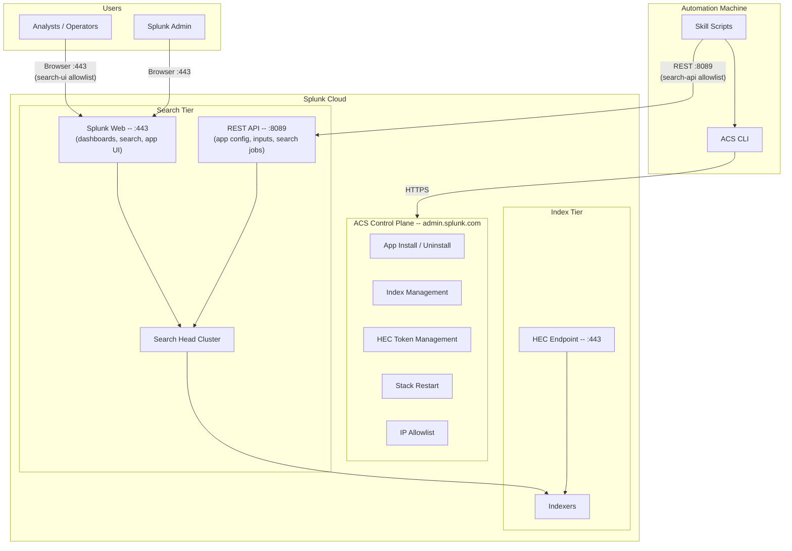
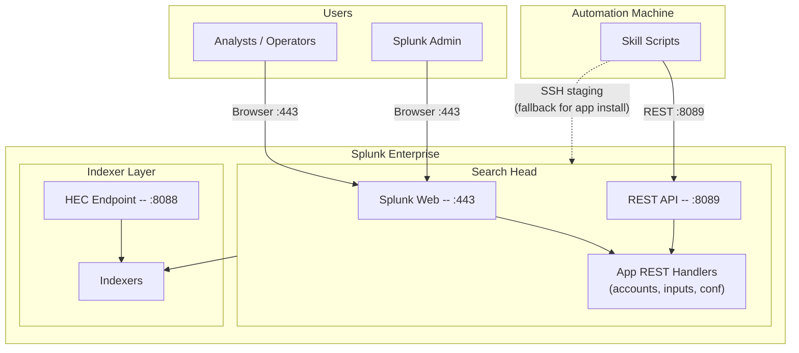
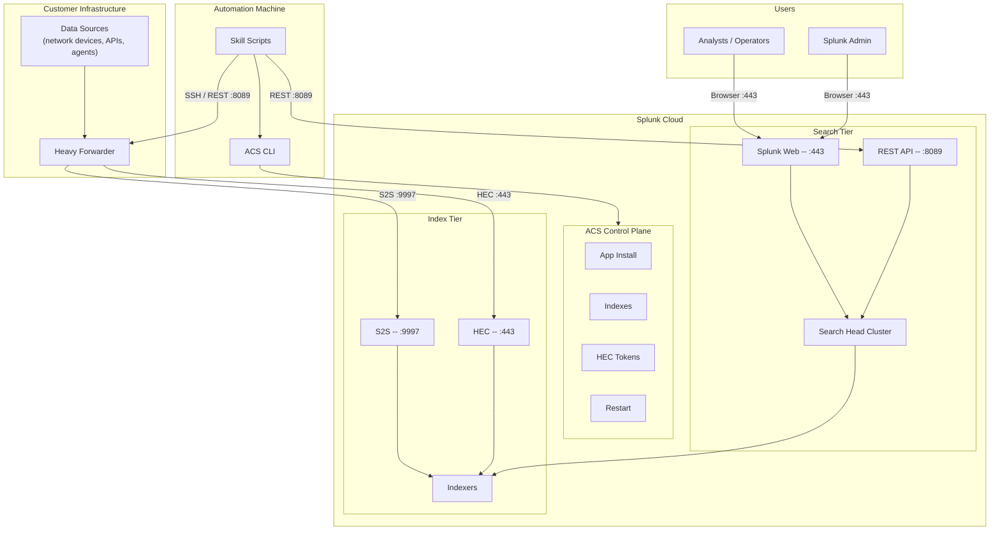
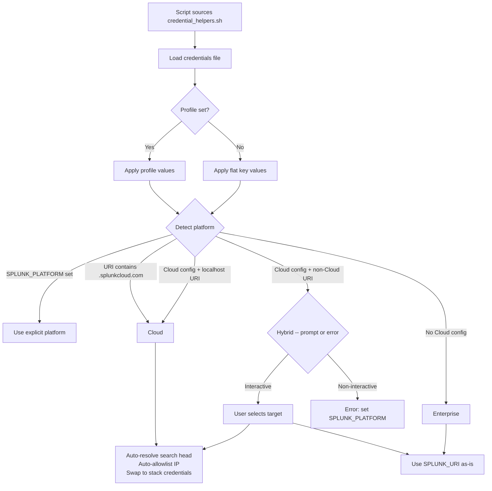
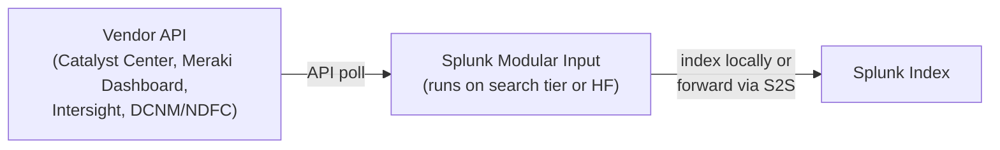
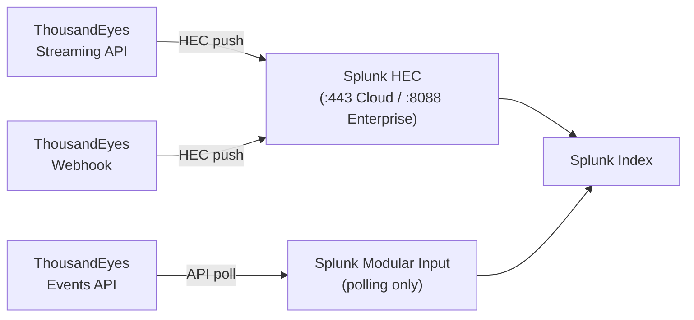
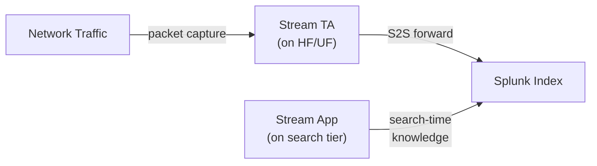
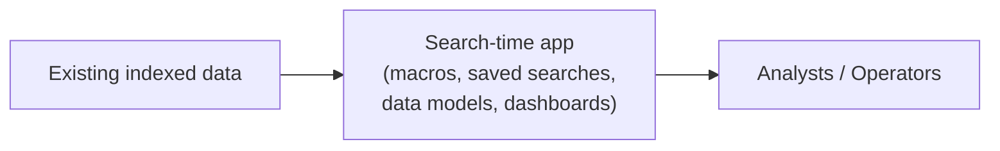

# Repository and Deployment Architecture

How this repo is organized, and how the shared automation adapts to Splunk
Cloud, Enterprise (on-prem), and hybrid deployments.

## Repository Architecture

This document complements `README.md`: the README is the operator-facing
overview, while this file focuses on the architectural boundaries inside the
repo and the runtime deployment models those scripts target.

### Core Building Blocks

| Path | Role |
|------|------|
| `skills/<skill>/` | Skill-specific docs and automation for install, setup, validation, and optional MCP loading |
| `skills/shared/lib/` | Shared platform layer for credentials, ACS, REST, Splunkbase, and account helpers |
| `skills/shared/scripts/` | Shared operational entrypoints such as credential setup and cloud batch install/uninstall |
| `skills/shared/app_registry.json` | Single source of truth for Splunkbase IDs, package patterns, app names, and license-ack metadata |
| `splunk-ta/` | Local package cache for downloaded or manually staged `.tgz` / `.spl` archives |
| `splunk-ta/_unpacked/` | Review-only extracted copies, not the normal deployment path |
| `tests/` and `.github/workflows/ci.yml` | Regression coverage for helper libraries and first-party shell scripts |

### Shared Helper Modules

All skill scripts source `skills/shared/lib/credential_helpers.sh`, which is a
compatibility shim over the focused shared modules:

| Module | Responsibility |
|--------|----------------|
| `credential_helpers.sh` | Sources the shared modules and locates the active credentials file |
| `credentials.sh` | Loads credential files, resolves profiles, and detects Cloud vs Enterprise vs hybrid targets |
| `acs_helpers.sh` | ACS login/context, current search-head resolution, `search-api` allowlisting, and Cloud index/restart helpers |
| `rest_helpers.sh` | Search-tier REST wrappers for apps, configs, inputs, saved searches, HEC, and validation |
| `splunkbase_helpers.sh` | Splunkbase authentication and package download helpers |
| `configure_account_helpers.sh` | Shared create-or-update flow for TA account endpoints |

### Skill Composition Pattern

Most skills follow the same layout, even if some omit optional files:

| File / directory | Purpose |
|------------------|---------|
| `SKILL.md` | Agent-facing instructions and expected workflow |
| `reference.md` | Product-specific notes such as input families, field mappings, or behavioral caveats |
| `scripts/setup.sh` | Default setup workflow |
| `scripts/validate.sh` | Post-deployment verification |
| `scripts/load_mcp_tools.sh` + `mcp_tools.json` | Optional search tooling loaded into `Splunk_MCP_Server` |

### Installer And Package Flow

- `skills/splunk-app-install/scripts/install_app.sh` is the generic app-delivery
  entrypoint used across the repo.
- On Splunk Enterprise, the installer tries REST upload first and falls back to
  SSH staging when direct upload is unavailable.
- On Splunk Cloud, the installer uses ACS and consults
  `skills/shared/app_registry.json` to map known package files to Splunkbase app
  installs, license acknowledgements, and expected app names.
- `skills/shared/scripts/cloud_batch_install.sh` batches ACS installs and
  performs a post-install identity check to catch corrupted or mis-mapped app
  deployments.

### Skill Roles

The current skills fall into three architectural roles:

- **Collector/setup skills** — install apps, create indexes, configure accounts,
  and enable inputs. Examples: Catalyst, DC Networking, Intersight, Meraki,
  and ThousandEyes.
- **Search-time / visualization skills** — configure macros, saved searches, or
  data model behavior on top of data collected elsewhere. Example:
  `cisco-enterprise-networking-setup`.
- **Platform/package skills** — manage generic app delivery or multi-component
  app stacks. Examples: `splunk-app-install`, `splunk-stream-setup`, and
  `splunk-itsi-setup`.

### CI And Validation

The repo treats the shared shell libraries as first-party code with regression
coverage. `.github/workflows/ci.yml` runs:

- `pytest` for Python tests
- `bats` for shell behavior tests
- `bash -n` for shell syntax checks
- `shellcheck` for static shell linting

## Deployment Models

### Splunk Cloud

All infrastructure is managed by Splunk. The repo interacts through two API
surfaces: ACS for platform operations and the search-tier REST API on port 8089
for app-specific configuration.

**Credential flow**: ACS uses `STACK_TOKEN` or `STACK_USERNAME/PASSWORD` plus
`SPLUNK_USERNAME/PASSWORD` for Splunkbase operations. Search-tier REST uses
`SPLUNK_USER/PASS` (defaulting to `STACK_USERNAME/PASSWORD` on Cloud).

**Automatic behaviors**:
- Direct search-head resolution via ACS to bypass SHC propagation delays
- Public IP auto-added to search-api allowlist
- Stack-local credentials swapped in for 8089 auth

### ACS Deployment Caveats

ACS app installs are generally reliable but have several edge cases that the
scripts defend against:

**App content corruption** — When multiple Splunkbase apps are installed in
rapid succession (especially after uninstall/reinstall cycles), ACS can
occasionally deploy the wrong app's files into another app's directory. This
corrupts the affected app: its custom REST handlers return 404, modular input
types do not register, and `app.conf` shows metadata from a different app. The
`cloud_batch_install.sh` script includes a post-install verification pass that
queries each app's `configs/conf-app/package` endpoint to confirm the `id`
field matches the expected app name. If a mismatch is detected, uninstall the
affected app and reinstall it individually.

**Visibility defaults to false** — TAs installed via ACS may have
`visible=false` in their app settings, making them invisible in Splunk Web. The
skill-specific `setup.sh` scripts auto-fix this by POSTing `visible=true` to
`/services/apps/local/{app}` during the default setup flow.

**409 on reinstall** — If ACS believes an app is already installed, a fresh
`apps install splunkbase` returns HTTP 409. The batch installer treats this as a
skip rather than a failure. To force a re-deployment, uninstall first via
`acs apps uninstall`, wait for the stack to settle, then install again.

### Enterprise (On-Prem)

A single Splunk instance or a distributed deployment under your control. All
operations go through the REST API on port 8089. ACS is not involved.

**Credential flow**: `SPLUNK_USER/PASS` for REST API access. `SPLUNK_SSH_*` for
remote file staging when REST upload is unavailable.

**App install paths** (tried in order):
1. REST upload via `/services/apps/local`
2. SSH staging to `$SPLUNK_HOME/etc/apps/`

### Hybrid (Cloud + Heavy Forwarder)

The most common production pattern for data collection TAs on Splunk Cloud.
The search tier runs in Splunk Cloud, but data collection happens on a
customer-controlled heavy forwarder (HF) or universal forwarder (UF).

**Credential flow**: The `credentials` file contains both Cloud (ACS/stack)
settings and Enterprise (HF) settings. The repo supports two resolution
strategies:

1. **Profile-based** -- `SPLUNK_PROFILE=cloud` and
   `SPLUNK_SEARCH_PROFILE=hf` in the credentials file. Cloud keeps
   platform/ACS settings while HF overrides search-tier REST and SSH settings.
2. **Platform override** -- `SPLUNK_PLATFORM=cloud` or
   `SPLUNK_PLATFORM=enterprise` per command to select the target explicitly.

When ambiguous, interactive scripts prompt the user to choose.

**Typical hybrid operations**:

| Operation | Target | API Surface |
|-----------|--------|-------------|
| App install on search tier | Cloud | ACS |
| Index creation | Cloud | ACS |
| TA account config on search tier | Cloud search head | REST :8089 |
| App install on HF | HF | REST :8089 or SSH |
| Input config on HF | HF | REST :8089 |
| Forwarder output config | HF | Host-level config |

## How Scripts Select the Target

## Port Usage Summary

| Port | Service | Used By | Allowlist Feature |
|------|---------|---------|-------------------|
| 443 | Splunk Web (UI) | Browser access | `search-ui` |
| 443 | HEC ingestion | ThousandEyes streams, webhook alerts | `hec` |
| 8089 | Search-tier REST API | All TA configuration and validation | `search-api` |
| 8089 | IDM API | Add-on data ingestion | `idm-api` |
| 8088 | HEC (Enterprise) | Enterprise HEC ingestion | N/A (local) |
| 9997 | S2S forwarding | HF/UF to Cloud indexers | `s2s` |
| 22 | SSH | Enterprise app staging fallback | N/A (local) |

## Data Flow by TA Type

### Polling TAs (Catalyst, Meraki, Intersight, DC Networking)

### HEC Push TAs (ThousandEyes)

### Passive Capture (Splunk Stream)

**Implementation guardrail**: in Splunk Cloud, `splunk-stream-setup` only
supports index creation against the Cloud stack. Installing Stream apps and
configuring `Splunk_TA_stream` must target the forwarder or Enterprise
management endpoint, because Stream remains a hybrid deployment.

### Search-Time And Premium Apps

Some skills do not own the collection path at all. They sit on top of existing
indexes and configure search-time knowledge objects, dashboards, or premium app
features.

**Examples**:
- `cisco-enterprise-networking-setup` updates macros, enables saved searches,
  and can enable data model acceleration for the visualization app.
- `splunk-itsi-setup` installs and validates the premium app layer that other
  skills may integrate with.
