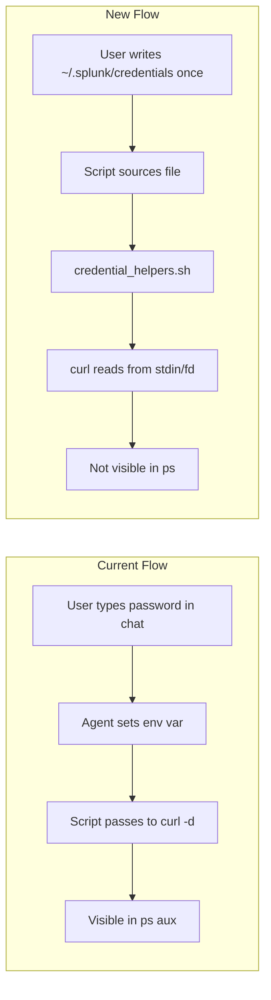

# Secure Credential Handling Across All Skills

## Problem

Credentials are exposed in plain text at three layers:

1. **Agent chat** -- the agent asks "what is your password?" and the user types it into the conversation, where it persists in transcript history
2. **Environment variables** -- `SPLUNK_PASS="secret" bash script.sh` is visible in `/proc/<pid>/environ`
3. **Process arguments** -- `curl -d "password=secret"` and `python3 script.py SESSION_KEY` are visible to all users via `ps aux`

22 of 26 scripts across 7 skills are affected.

## Architecture




## Key Design Decisions

- **Credential file**: `~/.splunk/credentials` with `chmod 600`, shell-sourceable format
- **Shared library**: `/home/splunk/.cursor/skills/shared/lib/credential_helpers.sh` sourced by all scripts
- **curl hardening**: POST data via `curl -d @-` (stdin), headers via `curl -K <(...)` (process substitution / fd)
- **Device credentials**: Read from temp file (`--password-file`) or stdin (`--password -`), never CLI args
- **Agent behavior**: Never ask for passwords in chat; guide user to populate the credential file

## Credential File Format

`~/.splunk/credentials` (chmod 600):

```bash
SPLUNK_USER="admin"
SPLUNK_PASS="changeme"
SB_USER=""
SB_PASS=""
```

Device credentials are one-time-use during account setup and should be passed via `--password-file /path/to/file` or interactive prompt. They are not stored in the credential file (Splunk encrypts them after account creation).

## Changes

### 1. Create shared credential helper library

**New file**: `skills/shared/lib/credential_helpers.sh`

Provides these functions used by all scripts:

- `load_splunk_credentials` -- reads from `~/.splunk/credentials`, falls back to interactive `read -rsp`; never accepts env vars
- `get_session_key URI` -- authenticates via `printf ... | curl -d @-` (keeps password off argv)
- `splunk_curl SK [curl_args...]` -- runs curl with session key passed via `-K <(printf ...)` process substitution (keeps SK off argv)
- `splunk_curl_post SK DATA [curl_args...]` -- same but pipes POST data via stdin
- `read_secret_from_file_or_prompt VARNAME FILEPATH PROMPT` -- reads a single secret from a file or prompts interactively
- `load_splunkbase_credentials` -- same pattern for SB_USER/SB_PASS

### 2. Create credential file setup script

**New file**: `skills/shared/scripts/setup_credentials.sh`

- Creates `~/.splunk/` directory (700)
- Creates `~/.splunk/credentials` (600) with placeholder template
- Opens user's editor (`$EDITOR` or `vi`) to fill in values
- Validates the file is readable and non-empty

### 3. Update all SKILL.md files (7 files)

Remove all patterns like:

```
SPLUNK_USER="theuser" SPLUNK_PASS="thepass" bash scripts/validate.sh
```

Replace agent behavior section across all skills with:

```
The agent must NEVER ask for passwords, API keys, or secrets in chat.
Instead, guide the user to run:
  bash ~/.cursor/skills/shared/scripts/setup_credentials.sh
Then run scripts normally -- they read credentials from ~/.splunk/credentials.
For device credentials, instruct the user to create a temp file and pass --password-file.
```

Files to update:

- [cisco-catalyst-ta-setup/SKILL.md](skills/cisco-catalyst-ta-setup/SKILL.md)
- [cisco-dc-networking-setup/SKILL.md](skills/cisco-dc-networking-setup/SKILL.md)
- [cisco-intersight-setup/SKILL.md](skills/cisco-intersight-setup/SKILL.md)
- [cisco-meraki-ta-setup/SKILL.md](skills/cisco-meraki-ta-setup/SKILL.md)
- [cisco-enterprise-networking-setup/SKILL.md](skills/cisco-enterprise-networking-setup/SKILL.md)
- [splunk-app-install/SKILL.md](skills/splunk-app-install/SKILL.md)
- [splunk-stream-setup/SKILL.md](skills/splunk-stream-setup/SKILL.md)

### 4. Update all scripts to use the helper library (22 scripts)

Each script gets these changes:

**a) Source the shared library** (replaces the credential-loading boilerplate):

```bash
source "/home/splunk/.cursor/skills/shared/lib/credential_helpers.sh"
load_splunk_credentials
SK=$(get_session_key "${SPLUNK_URI}")
```

**b) Replace all `curl -d "username=...&password=..."` with `get_session_key`** -- already handled by the helper.

**c) Replace all `curl -H "Authorization: Splunk ${SK}"` with `splunk_curl`**:

```bash
# Before (visible in ps):
curl -sk "${endpoint}" -H "Authorization: Splunk ${SK}" -d "name=${ACCT_NAME}" -d "password=${PASSWORD}"

# After (hidden from ps):
splunk_curl_post "${SK}" "name=${ACCT_NAME}&password=${PASSWORD}" "${endpoint}"
```

**d) Replace CLI arg device credentials with file-based input**:

```bash
# Before: --password PASS on command line
# After:  --password-file /path or interactive prompt

if [[ "${PASSWORD}" == "-" ]]; then
    read -rsp "Device password: " PASSWORD; echo
elif [[ -f "${PASSWORD}" ]]; then
    PASSWORD=$(<"${PASSWORD}")
fi
```

**e) Replace session key in python argv** (load_mcp_tools.sh scripts):

```bash
# Before: python3 - "$TOOLS" "$URI" "${SESSION_KEY}" ...
# After:  pass SESSION_KEY on stdin via env or fd
export __SK="${SESSION_KEY}"
python3 - "${MCP_TOOLS_JSON}" "${SPLUNK_URI}" "${APP_CONTEXT}" ...
# Python reads: session_key = os.environ.pop('__SK')
```

### 5. Sanitize error output

In all scripts, replace patterns like:

```bash
echo "${resp}" | head -20
```

With a redaction helper that strips known sensitive fields before printing.

### Scripts to update (grouped by skill)


| Skill                             | Scripts                                                                             |
| --------------------------------- | ----------------------------------------------------------------------------------- |
| cisco-catalyst-ta-setup           | configure_account.sh, validate.sh, load_mcp_tools.sh, setup.sh                      |
| cisco-dc-networking-setup         | configure_account.sh, validate.sh, load_mcp_tools.sh, setup.sh                      |
| cisco-intersight-setup            | configure_account.sh, validate.sh, load_mcp_tools.sh, setup.sh                      |
| cisco-meraki-ta-setup             | configure_account.sh, validate.sh, load_mcp_tools.sh, setup.sh, setup_dashboards.sh |
| cisco-enterprise-networking-setup | validate.sh, load_mcp_tools.sh, setup.sh                                            |
| splunk-app-install                | install_app.sh, list_apps.sh, uninstall_app.sh                                      |
| splunk-stream-setup               | setup.sh, validate.sh, configure_streams.sh                                         |


### 6. Create a workspace rule for credential handling

New rule file `.cursor/rules/credential-handling.mdc` that instructs the agent:

- Never ask for passwords, API keys, tokens, or secrets in conversation
- Always direct users to `~/.splunk/credentials` for Splunk creds
- Always direct users to use `--password-file` for device credentials
- Never pass `SPLUNK_PASS` or similar as environment variables in shell commands

